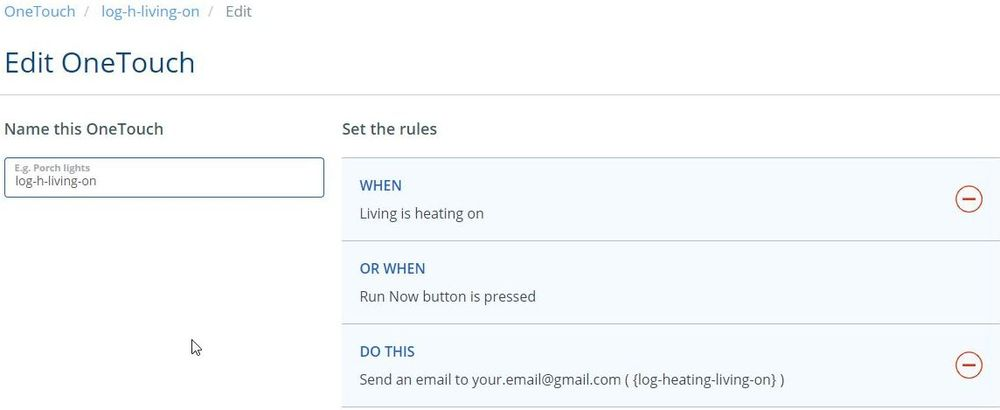
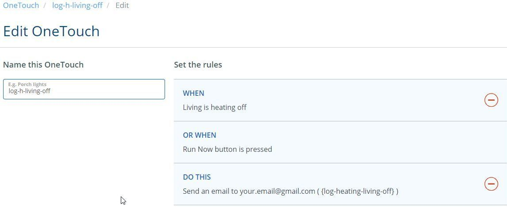
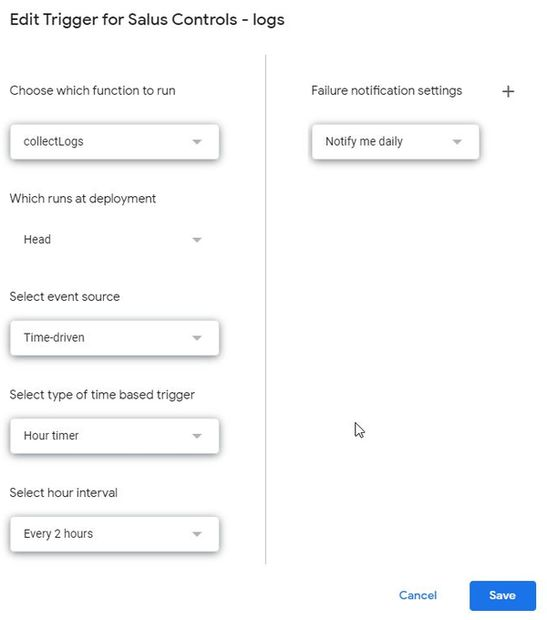

# Salus Logs

Collect logs from [https://eu.salusconnect.io](https://eu.salusconnect.io/dashboard)

## 1. For each Termostat create 2 OneTouch rules for ON & OFF to send an email

- Rules name must be in following format "log-h-living-on" & "log-h-living-off"
  change change "living" with your rooms.
- content to send can be for example "{log-heating-living-on}" & "{log-heating-living-off}" - or any details you want.

## 2. in Gmail mark this emails as not importants and to skip inbox

- open gmail Settings / Filters and Blocked Addresses
- create a new Filter:
    - Matches: from:(support@sc-smarthome.io OR support@salusconnect.io) subject:(OneTouch rule log-)
    - Do this: Skip Inbox, Never send it to Spam, Never mark it as important

## 3. Import and "Salus-Controls.xlsx" in Google Drive

Import [Salus-Controls.xlsx](Salus-Controls.xlsx) as google sheet
...TODO...

### Adjust summary view (second sheet)

Multiply rooms as needed.

### Open Tools/Script editor

- copy content of [script.js](script.js) and paste it inside "Script editor"
- press "Current project triggers" button (clock icon)
    - select collectLogs() as function to run
    - Time driven & hour timer & Every 2 hours

