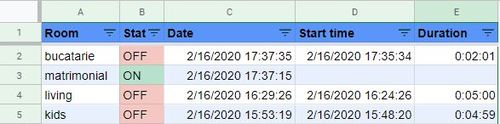

# Salus Logs

Collect logs from [https://eu.salusconnect.io](https://eu.salusconnect.io/dashboard)

**Main idea**

- [x] make **salus** send you **emails** when Termostat starts and stops 
- [x] script will read those emails periodicaly and insert them in a **google sheet**
- [x] **reports** how much time a thermostat runs **each day** in **each room**

**Results**

## Requirements

- [salusconnect.io](https://eu.salusconnect.io/dashboard) Account
- [Gmail](https://mail.google.com/) Account

## 1. For each Termostat create 2 OneTouch rules for ON & OFF to send an email

- Rules name must be in following format **"log-h-living-on"** & **"log-h-living-off"**
  change change "living" with your rooms.
- content to send can be for example "{log-heating-living-on}" & "{log-heating-living-off}" - or any details you want.

## 2. in Gmail mark this emails as not importants and to skip inbox

- open gmail **Settings** (cog wheel) / **Filters and Blocked Addresses**
- create a new Filter:
    - Matches: 
      - from: **support@sc-smarthome.io OR support@salusconnect.io**
      - subject: **OneTouch log-h-**
    - next, Do this: 
      - Skip Inbox
      - Never send it to Spam
      - Never mark it as important

## 3. Make a copy of "Salus Controls" in your Google Drive

Open Google spreadsheets example [Salus Controls Demo](https://docs.google.com/spreadsheets/d/185eJTC7BAHvtVL5FA-NkhWEhe1ENYjVyGXD5xyUEPTA/edit?usp=sharing)
and make a copy of it (to have your own document)

**File** -> **Make a copy** -> 
  then your select name and folder where to store this file

### Adjust summary view (second sheet)

Multiply rooms as needed.

### Open Tools/Script editor

- press "Current project triggers" button (clock icon)
    - press "+ Add Trigger"
    - select **collectLogs()** as function to run
    - Time driven & hour timer & Every 2 hours

- if you are a developer, and want to make sure the code is **safe**: see [script.js](script.js) :) 

## 4. DONE

Hope it helps you! if it is you can **star** this repo.

## TODOs

- [ ] know issue: timezone change (handle -1h change)
- [ ] fix startTime when is "12/30/1899 0:00:00"